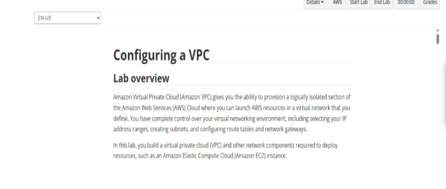

# AWS VPC Networking with Public & Private Subnets  
**Hands-On Lab | AWS re/Start Journey**

A complete, secure VPC setup with **public & private subnets**, **Internet Gateway**, and **NAT Gateway** – the exact pattern used in real production environments.

![Architecture Diagram] (VPC Screenshots/Diagram of Overview.png)

---

## Lab Overview (From the Official Lab Guide)

This lab teaches how to isolate resources using public and private subnets – a **must-know** and crucial skill for any Cloud Engineer.



---

## Step-by-Step Walkthrough (With Real Screenshots)

### Step 1: Create Custom VPC
**What I did**: Created a new VPC with CIDR `10.0.0.0/16`  
**Result**: Isolated network foundation for the entire lab.

```text
VPC ID: vpc-0c832a70e724d9b03
Name: Lab VPC
State: Available


**What I learnt in this lab**
Internet Gateway,Allows bidirectional traffic for public subnets
NAT Gateway,Allows outbound only from private subnets
Never put NAT in private subnet,It would have no route to the internet!
Route table association,Must explicitly associate subnets with custom route tables
