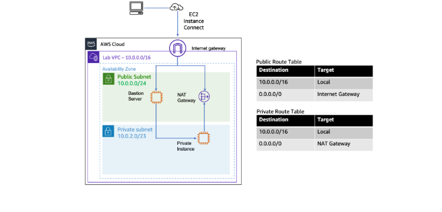

# AWS VPC Networking with Public & Private Subnets  
**Hands-On Lab | AWS re/Start Journey**

A complete, secure VPC setup with **public & private subnets**, **Internet Gateway**, and **NAT Gateway** – the exact pattern used in real production environments.



---

## Lab Overview (From the Official Lab Guide)

This lab teaches how to isolate resources using public and private subnets – a **must-know** and crucial skill for any Cloud Engineer.


---

## Step-by-Step Walkthrough (With Real Screenshots)

### Step 1: Create Custom VPC
**What I did**: Created a new VPC with CIDR `10.0.0.0/16`  
**Result**: Isolated network foundation for the entire lab.

```text
VPC ID: vpc-0c832a70e724d9b03
Name: Lab VPC
State: Available

Step 2: Create Public & Private Subnets
What I did:

Public Subnet → 10.0.0.0/24 (for NAT Gateway)
Private Subnet → 10.0.2.0/23 (for secure instances)

Subnets created and visible in console

Step 3: Create & Attach Internet Gateway
What I did:

Created Internet Gateway
Attached it to Lab VPC so the public subnet can reach the internet.

Attaching the Internet Gateway to the VPC
Result: Internet Gateway is now live and attached.
Internet Gateway details – attached and ready

Step 4: Create NAT Gateway (in Public Subnet)
What I did:
Placed NAT Gateway in the public subnet with an Elastic IP.
This allows private instances to download updates without being exposed to inbound traffic.
textNAT Gateway ID: nat-020c35d27308d329
State: Available
Location: Public Subnet (10.0.0.0/24)
NAT Gateway created successfully

Step 5: Route Tables (The Key to Security!)
Public Route Table → 0.0.0.0/0 → Internet Gateway (full internet)
Private Route Table → 0.0.0.0/0 → NAT Gateway (outbound only)
This separation is why private instances stay secure.

**What I learnt in this lab**
Internet Gateway,Allows bidirectional traffic for public subnets
NAT Gateway,Allows outbound only from private subnets
Never put NAT in private subnet,It would have no route to the internet!
Route table association,Must explicitly associate subnets with custom route tables
